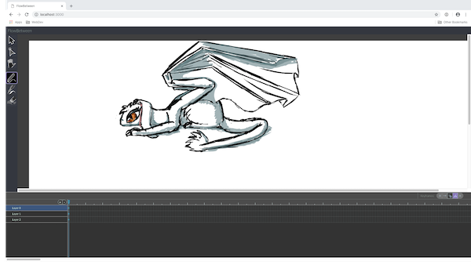

# FlowBetween



FlowBetween is a tool for creating animations. It is also a vector editor designed to provide a 'painterly'
workflow, differing from most other tools in that editing is more about painting using brushes than tweaking
paths.

## Running FlowBetween

[Building FlowBetween](https://flowbetween.app/building.html)

If you're using OS X you can download a pre-built binary from the [website](https://flowbetween.app).

FlowBetween has a unique architecture which makes its user interface extremely portable. In this early release,
the in-browser version is easiest to play with as it will work on all operating systems. Note that to use
a tablet with FlowBetween, you'll ideally need a browser that fully supports either the pointer events or the
touch API. On OS X, Chrome or Firefox are your best choices. On Windows, just Firefox. Safari on iOS will work
with the Apple Pencil.

To build run FlowBetween, install Rust and download this repository. Type:

```bash
cargo run --features http --release
```

and connect to localhost:3000 in your browser of choice. Select the paint tool to start drawing.

On Linux, you can try out the Gtk port:

```bash
cargo run --features gtk --release
```

or you can show off one of the more interesting features of FlowBetween's architecture by combining the gtk and
http UIs into one executable:

```bash
cargo run --features gtk --features http --release
```

While this is a bit of a gimmick right now, it shows a couple of things: FlowBetween has an extremely portable 
architecture (I'm aware of no other application in existence that can run two independent UI ports side by side
in the same executable). More importantly, this is intended to evolve into a feature that allows for seamless
editing on the desktop and on the move (and collaborative editing of a single canvas).

## Some technical stuff

FlowBetween's architecture is based around streams in the same way most other applications are based around
objects. Anybody who has programmed in SmallTalk would probably recognise the idea. There's also a strong principle
of separating libraries that represent a concept from those that provide a concrete implementation. To pick an
important example: the `flo_canvas` library provides all the primitives for vector drawing but no implementation
at all. `flo_gtk_ui` and `flo_http_ui` both have the ability to take a stream of these updates and actualise
them using their respective user interface languages.

The `flo_binding` library is well worth a look while you're here. It's re-usable in any UI framework due to
FlowBetween's separation principle and will be familiar to anyone who has encountered libraries like Knockout
or React. It's essentially a way of changing a stream of events into a representation of a state and vice-versa,
which is one of the core problems of UI design.

There are several sister projects that have moved to their own repository. `desync` provides asynchronous
functionality, using a concept of scheduling operations on data (the reverse of the usual concept of scheduling
data on threads). `flo_curves` provides the library of algorithms needed for FlowBetween to generate vector
graphics. `flo_stream` adds a 'pub-sub' mechanism to Rust's futures library, which is a great way to distribute
events around a user interface using streams.

## --|||--

---


